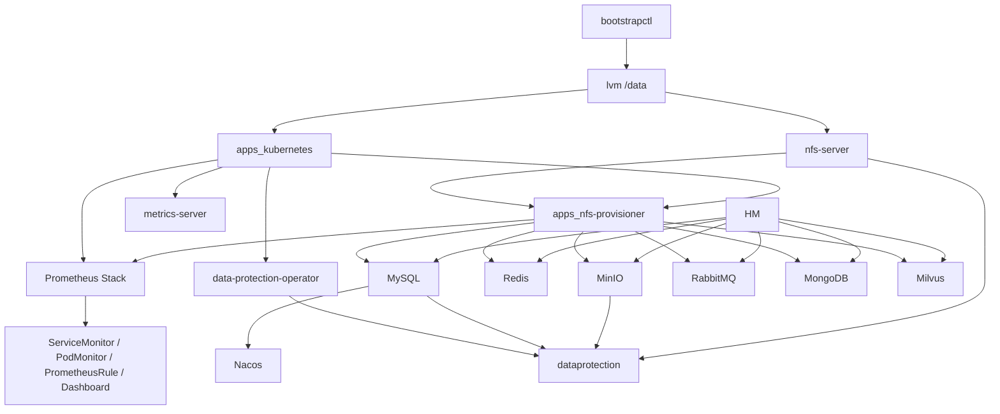

# ArchInfra 统一交付与运维入口

这份文档面向两类使用者：

- 新接手这套平台的运维、研发或交付同学
- 后续会读取文档并代替人执行安装、巡检、扩缩容的 AI / 自动化系统

目标不是只告诉你“有哪些仓库”，而是让你在一台已经具备安装包的 Linux 服务器上，按统一顺序完成：

1. 主机初始化
2. 数据盘与 NFS 准备
3. Kubernetes 安装
4. 监控底座安装
5. 数据保护控制面安装
6. 中间件安装
7. HM 业务应用安装

同时保证后来的人和 AI 能快速知道：

- 当前平台有哪些仓库、哪些产物、分别负责什么
- 默认的访问地址、账密、命名空间、依赖关系是什么
- 哪些监控资源会被 Prometheus 自动发现
- 哪些 Dashboard 会被 Grafana 自动导入
- 备份恢复该怎么接入，当前推荐先验证哪条路径

资源、地址和默认账密速查表见：

- [RESOURCE-BASELINE.zh-CN.md](./RESOURCE-BASELINE.zh-CN.md)

## 1. 组织仓库与交付物映射

| 分类 | 仓库 | 产物 / 作用 |
| --- | --- | --- |
| 发布包下载 | `archinfra/mc` | `hm-release-downloader-<arch>.run`，一键从 MinIO 拉取 `hm-release/<arch>` |
| 主机初始化 | `archinfra/bootstrapctl` | `/opt/release/boot`，生成 `inventory.yaml`、`profile.yaml`、`ops-environment.sh` |
| 数据盘 | `archinfra/lvm` | `/opt/release/lvm.sh`，初始化并挂载 `/data` |
| NFS 服务端 | `archinfra/nfs-server` | `/opt/release/nfs-server.sh`，在 `master-01` 导出 `/data/nfs-share` |
| Kubernetes | `archinfra/apps_kubernetes` | `/opt/release/k8s-sealos-linux-<arch>-full.run` |
| NFS StorageClass | `archinfra/apps_nfs-provisioner` | `/opt/release/nfs-provisioner-installer-<arch>.run` |
| 资源采集 | `archinfra/apps_metrics-server` | `/opt/release/metrics-server-installer-<arch>.run` |
| 监控底座 | `archinfra/app_prometheus-stack` | `/opt/release/prometheus-stack-installer-<arch>.run` |
| 数据保护安装器 | `archinfra/data-protection-operator` | `/opt/release/data-protection-operator-<arch>.run` |
| 数据保护控制面源码 | `archinfra/dataprotection` | 资源模型、samples、addon、quickstart、user case |
| MySQL | `archinfra/apps_mysql` | `/opt/release/mysql-installer-<arch>.run` |
| Redis | `archinfra/apps_redis-cluster` | `/opt/release/redis-cluster-installer-<arch>.run` |
| Nacos | `archinfra/apps_nacos` | `/opt/release/nacos-installer-<arch>.run` |
| MinIO | `archinfra/apps_minio-cluster` | `/opt/release/minio-cluster-installer-<arch>.run` |
| RabbitMQ | `archinfra/apps_rabbitmq-cluster` | `/opt/release/rabbitmq-cluster-installer-<arch>.run` |
| MongoDB | `archinfra/apps_mongodb-cluster` | `/opt/release/mongodb-cluster-installer-<arch>.run` |
| Milvus | `archinfra/apps_milvus-cluster` | `/opt/release/milvus-cluster-installer-<arch>.run` |
| HM 业务集成包 | `archinfra/hm` | `/opt/release/hm-installer-<arch>.run` |

## 2. 当前统一交付约定

这套平台不是“每个项目各搞一套风格”，而是逐步统一到同一类离线交付习惯：

- 优先提供 `amd64` / `arm64` 两种 `.run` 安装包
- 优先通过 GitHub Actions 构建 release
- 安装前先执行 `help` 或 `--help`
- 安装后必须执行 `status`
- 已经在内网仓库存在镜像时，优先使用 `--skip-image-prepare`
- 资源档位逐步统一到 `--resource-profile low|mid|high`
- 较新的安装器支持 `install -f <config.yaml>` 或 `samples` 导出模板

注意：

- 不是所有安装器都已经支持完全一样的参数
- 不要凭经验假设参数名，执行前始终以当前包的 `help` 输出为准

## 3. 安装包获取方式

### 3.1 场景 A：服务器上已经放好 `/opt/release`

这是默认交付方式。开始前先确认：

```bash
ls -lh /opt/release
uname -m
```

### 3.2 场景 B：通过 MinIO 一键拉取 release

如果目标机器还没有安装包，可以先使用 `archinfra/mc` 产出的下载器：

```bash
chmod +x ./hm-release-downloader-amd64.run
./hm-release-downloader-amd64.run --target-dir /opt/release-cache
```

它会：

- 自动识别当前机器架构
- 让你交互输入 MinIO `AK/SK`
- 自动下载 `hm-release/amd64` 或 `hm-release/arm64`

默认 MinIO 地址是：

- `https://minio-console.hm.metavarse.tech:9443`

## 4. 基础环境默认约定

| 项目 | 默认值 |
| --- | --- |
| 安装包目录 | `/opt/release` |
| 建议工作目录 | `/opt/cluster-deploy` |
| LVM 挂载点 | `/data` |
| NFS 导出目录 | `/data/nfs-share` |
| container graph root | `/data/graphroot` |
| containerd 数据目录 | `/data/containerd` |
| NFS Server 节点 | `master-01` |
| 默认 StorageClass | `nfs` |
| 中间件默认命名空间 | `aict` |
| Milvus 默认命名空间 | `milvus-system` |
| Prometheus 默认命名空间 | `monitoring` |
| 数据保护 operator 命名空间 | `data-protection-system` |
| 数据保护业务命名空间 | `backup-system` |

## 5. 标准安装顺序

推荐顺序如下：

1. `bootstrapctl` 生成主机级配置
2. `lvm` 初始化并挂载 `/data`
3. `nfs-server` 在 `master-01` 提供 `/data/nfs-share`
4. `apps_kubernetes` 安装 Kubernetes
5. `apps_nfs-provisioner` 安装默认 `nfs` StorageClass
6. `apps_metrics-server` 打开资源采集
7. `app_prometheus-stack` 安装监控底座
8. `data-protection-operator` 安装数据保护控制器
9. 安装各个中间件
10. 根据已上线的数据源接入备份恢复策略
11. 最后安装 HM 业务应用

### 5.1 bootstrapctl

```bash
cd /opt/cluster-deploy
cp /opt/release/boot ./boot
chmod +x ./boot

./boot init -d ./bootstrap/demo-env -c demo-env
./boot scan -i ./bootstrap/demo-env/inventory.yaml -t 20s
./boot plan -i ./bootstrap/demo-env/inventory.yaml -p ./bootstrap/demo-env/profile.yaml -t 20s
./boot apply -i ./bootstrap/demo-env/inventory.yaml -p ./bootstrap/demo-env/profile.yaml -t 20s
./boot verify -i ./bootstrap/demo-env/inventory.yaml -p ./bootstrap/demo-env/profile.yaml -t 20s
```

补充导出旧脚本兼容环境：

```bash
./boot export-ops-env \
  -i ./bootstrap/demo-env/inventory.yaml \
  -o ./bootstrap/demo-env/ops-environment.sh
```

### 5.2 LVM / NFS Server / Kubernetes / NFS StorageClass

```bash
/opt/release/lvm.sh -y --vg-name ops_vg_data --lv-name ops_lv_data --mount-point /data --fs-type xfs --disks /dev/vdb
/opt/release/nfs-server.sh -d /data/nfs-share -y
/opt/release/k8s-sealos-linux-amd64-full.run help
/opt/release/nfs-provisioner-installer-amd64.run install --nfs-server <master-01-ip> --nfs-path /data/nfs-share -y
```

### 5.3 metrics-server

```bash
/opt/release/metrics-server-installer-amd64.run install --kubelet-insecure-tls -y
/opt/release/metrics-server-installer-amd64.run status
kubectl top nodes
```

### 5.4 Prometheus Stack

```bash
/opt/release/prometheus-stack-installer-amd64.run install \
  --namespace monitoring \
  --grafana-admin-password 'admin@passw0rd' \
  -y

/opt/release/prometheus-stack-installer-amd64.run status -n monitoring
```

默认外部访问：

- Grafana: `http://<任一节点IP>:30090`
- Prometheus: `http://<任一节点IP>:30091`

### 5.5 Data Protection Operator

```bash
/opt/release/data-protection-operator-amd64.run install -y
/opt/release/data-protection-operator-amd64.run status
```

建议理解方式：

- `data-protection-operator` 负责安装 controller、CRD、RBAC
- `dataprotection` 仓库负责 samples、addon、quickstart、user case

当前最成熟的验证路径：

- 先安装 MySQL
- 再准备一套专用 MinIO 或 NFS 作为备份后端
- 再按 `dataprotection` 仓库的 quickstart/user case 接入 MySQL 备份恢复

### 5.6 中间件

推荐顺序：

1. MySQL
2. Redis
3. Nacos
4. MinIO
5. RabbitMQ
6. MongoDB
7. Milvus

最小安装示例：

```bash
/opt/release/mysql-installer-amd64.run install --resource-profile mid -y
/opt/release/redis-cluster-installer-amd64.run install --resource-profile mid -y
/opt/release/nacos-installer-amd64.run install --mysql-host mysql-0.mysql.aict --mysql-password 'passw0rd' --resource-profile mid -y
/opt/release/minio-cluster-installer-amd64.run install --resource-profile mid -y
/opt/release/rabbitmq-cluster-installer-amd64.run install --resource-profile mid -y
/opt/release/mongodb-cluster-installer-amd64.run install --resource-profile mid -y
/opt/release/milvus-cluster-installer-amd64.run install --resource-profile mid -y
```

### 5.7 HM 业务应用

HM 必须在这些组件都 ready 后再安装：

- MySQL
- Redis
- MinIO
- MongoDB
- RabbitMQ
- Milvus

安装命令：

```bash
/opt/release/hm-installer-amd64.run help
/opt/release/hm-installer-amd64.run install -y
/opt/release/hm-installer-amd64.run status
```

如果需要更强可定制性，优先使用：

```bash
/opt/release/hm-installer-amd64.run samples --output-dir ./hm-samples
/opt/release/hm-installer-amd64.run install -f ./hm-config.yaml -y
```

## 6. 组件依赖关系



## 7. 平台统一监控契约

### 7.1 Prometheus 自动发现契约

Prometheus 默认跨 namespace 发现监控资源，但只会选择带下面标签的对象：

```text
monitoring.archinfra.io/stack=default
```

适用资源：

- `ServiceMonitor`
- `PodMonitor`
- `Probe`
- `PrometheusRule`

### 7.2 Grafana 自动 Dashboard 契约

Grafana sidecar 默认跨 namespace 搜索 Dashboard ConfigMap，契约如下：

- 标签：`grafana_dashboard=1`
- 可选注解：`grafana_folder=<目录名>`

示例：

```yaml
metadata:
  labels:
    grafana_dashboard: "1"
    monitoring.archinfra.io/stack: default
  annotations:
    grafana_folder: "Middleware/MySQL"
```

### 7.3 当前默认监控开启情况

| 组件 | 默认监控 |
| --- | --- |
| MySQL | exporter + ServiceMonitor |
| Redis | exporter + ServiceMonitor |
| Nacos | metrics + ServiceMonitor |
| MinIO | metrics + ServiceMonitor |
| RabbitMQ | metrics + ServiceMonitor + PrometheusRule |
| MongoDB | metrics + ServiceMonitor |
| Milvus | Milvus ServiceMonitor + embedded etcd/MinIO 监控 |

### 7.4 告警理解方式

Prometheus Stack 自带 Kubernetes 基础告警规则，但应用级告警需要各中间件仓库自己补 `PrometheusRule`。推荐理解为两层：

- 平台层：Kubernetes、node、kubelet、prometheus、alertmanager 默认规则
- 应用层：MySQL、Redis、MinIO、RabbitMQ、MongoDB、Milvus 各自的指标和规则

## 8. 平台统一数据保护契约

### 8.1 数据保护平台由哪两部分组成

- `data-protection-operator`
  - 安装 controller、CRD、RBAC、notification gateway
- `dataprotection`
  - 提供 `BackupAddon`、`BackupSource`、`BackupStorage`、`BackupPolicy`、`BackupJob`、`RestoreJob`、`Snapshot` 等模型和样例

### 8.2 当前已经明确的能力

- `BackupStorage` 当前支持 `nfs` 和 `minio`
- `BackupPolicy` 支持多存储 fan-out
- `RestoreJob` 支持按平台 `Snapshot` 恢复
- `RestoreJob` 支持按导入包恢复
- 保留策略会同时清理 CR 和后端历史文件
- Webhook 通知已经进入统一模型

### 8.3 当前推荐的接入方式

不要把备份系统理解成“某个中间件自己的 shell 脚本”。更适合的理解方式是：

- 平台层负责调度、上传下载、保留、通知、恢复入口
- 中间件只通过 addon 提供导入导出逻辑

当前最建议先验证：

- MySQL + MinIO
- MySQL + NFS

## 9. 组件默认信息速览

| 组件 | 命名空间 | 内网访问 | 外网访问 | 默认账密 / 备注 |
| --- | --- | --- | --- | --- |
| Prometheus Stack | `monitoring` | `prometheus-stack-kube-prom-prometheus.monitoring.svc:9090` | Grafana `30090`，Prometheus `30091` | Grafana `admin / admin@passw0rd` |
| Data Protection Operator | `data-protection-system` | 控制器，不提供业务入口 | 不暴露 | 业务 CR 常用命名空间 `backup-system` |
| MySQL | `aict` | `mysql.aict.svc.cluster.local:3306` | `30306` | `root / passw0rd` |
| Redis | `aict` | `redis-cluster.aict.svc.cluster.local:6379` | 默认不暴露 | 密码 `Redis@Passw0rd` |
| Nacos | `aict` | `http://nacos.aict.svc.cluster.local:8848/nacos` | HTTP `30094`，gRPC `30930` | 默认依赖 MySQL `frame_nacos_demo` |
| MinIO | `aict` | `minio.aict.svc.cluster.local:9000` | API `30093`，Console `30092` | `minioadmin / minioadmin@123` |
| RabbitMQ | `aict` | `rabbitmq-cluster.aict.svc.cluster.local:5672` | 默认不暴露 | `admin / RabbitMQ@Passw0rd` |
| MongoDB | `aict` | `mongodb-cluster-0..2.mongodb-cluster-headless.aict.svc.cluster.local:27017` | 默认不暴露 | `root / MongoDB@Passw0rd` |
| Milvus | `milvus-system` | `milvus-cluster.milvus-system.svc.cluster.local:19530` | 默认不暴露 | 默认 `cluster` 模式 |
| HM | `aict` | 依赖各中间件 service | `30080 / 31721 / 32136 / 31285 / 31196` | 强依赖 MySQL、Redis、MinIO、MongoDB、RabbitMQ、Milvus |

## 10. 安装后的记录规范

每装完一个组件，建议记录下面这张信息卡：

```text
组件名:
安装时间:
安装命令:
安装包版本:
命名空间:
内部地址:
外部地址:
默认账密或已轮换账密:
依赖组件:
PVC / 存储:
status 结果:
备注:
```

## 11. 给新接手同事和 AI 的执行规则

1. 先识别当前机器架构，再选择对应 `amd64` 或 `arm64` 安装包。
2. 任何安装前，先执行该包的 `help`。
3. 任何安装后，至少执行：
   - `<installer> status`
   - `kubectl get pods,svc,pvc -n <namespace>`
4. 看到 PVC `Pending` 时，优先检查：
   - NFS Server
   - NFS StorageClass
   - `/data/nfs-share`
5. 看到监控未发现时，优先检查监控对象是否带：
   - `monitoring.archinfra.io/stack=default`
6. 看到 Dashboard 未自动出现时，优先检查 ConfigMap 是否带：
   - `grafana_dashboard=1`
7. 看到数据保护未生效时，优先检查：
   - operator 是否 ready
   - `BackupStorage` probe 是否成功
   - 数据源和 addon 是否已经注册
8. 生产环境部署完成后，必须轮换默认密码。

## 12. 延伸阅读

- [RESOURCE-BASELINE.zh-CN.md](./RESOURCE-BASELINE.zh-CN.md)
- `archinfra/dataprotection` 仓库中的 quickstart、user case、samples
- 各中间件仓库各自 README 中的 `help` 示例和资源档位说明
